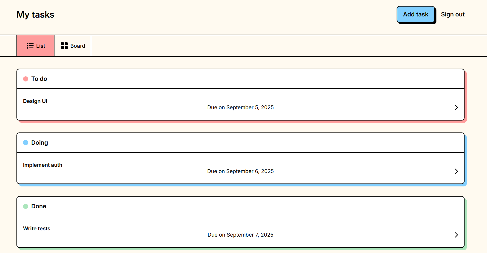
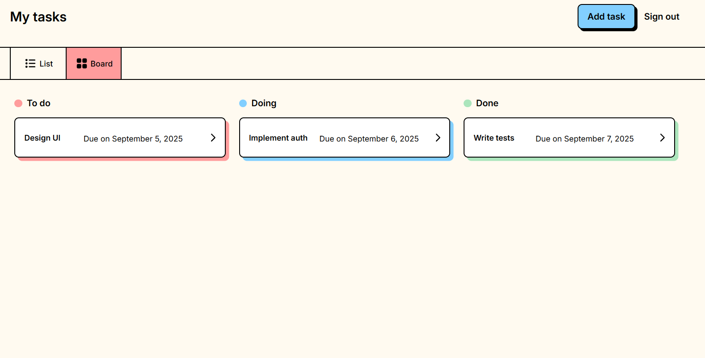
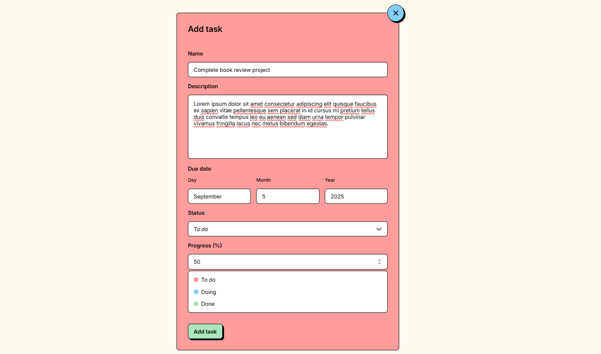
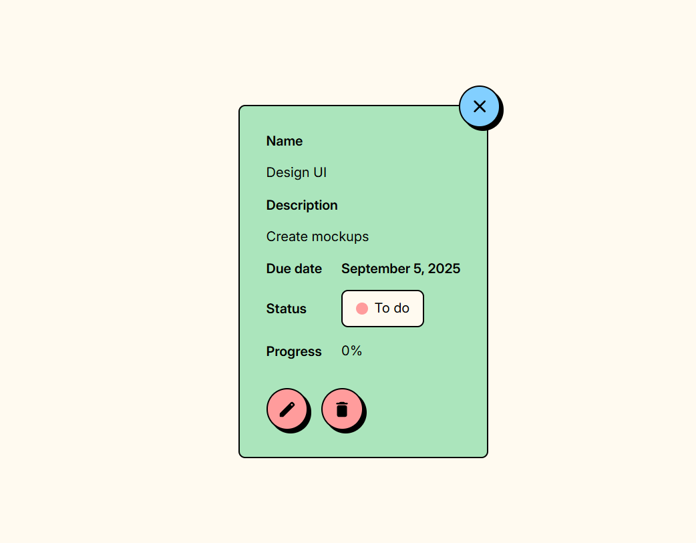

# Task Manager

A simple task management app with List and Board views. Built with HTML, CSS, and vanilla JavaScript.

## Screenshots

### List View


### Board View


### Task Management



## Features

- Switch between List and Board views
- Create, edit, and delete tasks
- Set task status (To Do, Doing, Done)
- Track task progress
- Add due dates
- Tasks saved automatically in browser

## Quick Start

1. Clone and run:
```bash
git clone https://github.com/yourusername/task-manager.git
cd task-manager

# Using Python to serve (or use any static server)
python -m http.server 8000
```

2. Open in browser:
```
http://localhost:8000/pages/login.html
```

## How to Use

1. **Add a Task**
   - Click "Add task"
   - Fill in name, description, due date
   - Set status and progress
   - Click Save

2. **Edit/Delete Tasks**
   - Click any task to view details
   - Use pencil icon to edit
   - Use trash icon to delete

3. **Switch Views**
   - Use the List/Board radio buttons
   - Both views show the same tasks

## Project Files

```
task-manager/
├── css/          # Styles
├── js/           # JavaScript
├── pages/        # HTML pages
└── img/          # Images
```

## Tech Stack

- HTML5
- CSS3
- JavaScript (No frameworks)
- localStorage for saving tasks

## License

MIT License - use freely for your own projects!